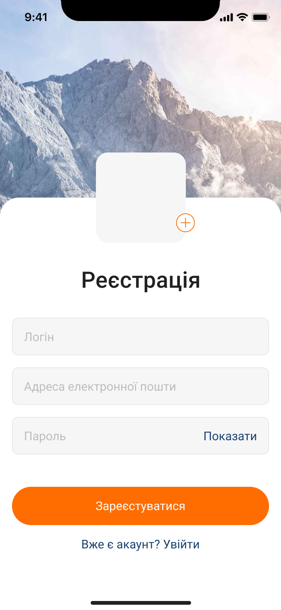
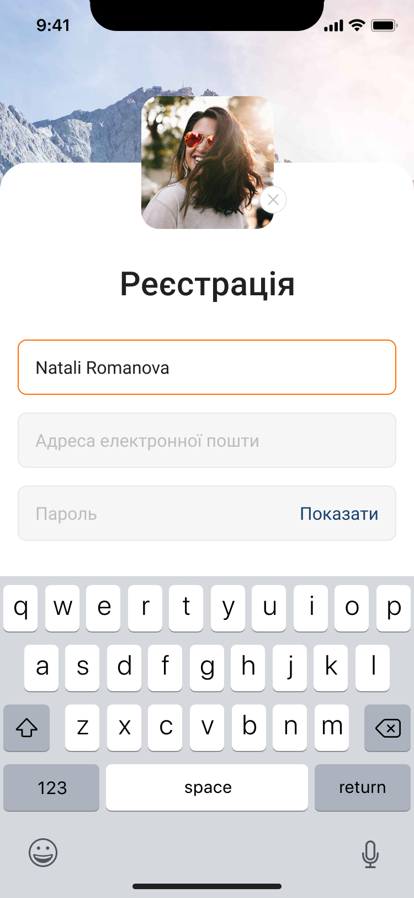
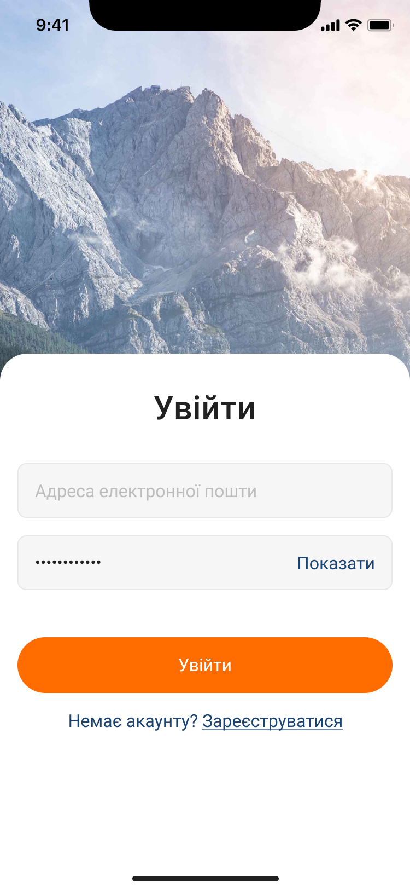
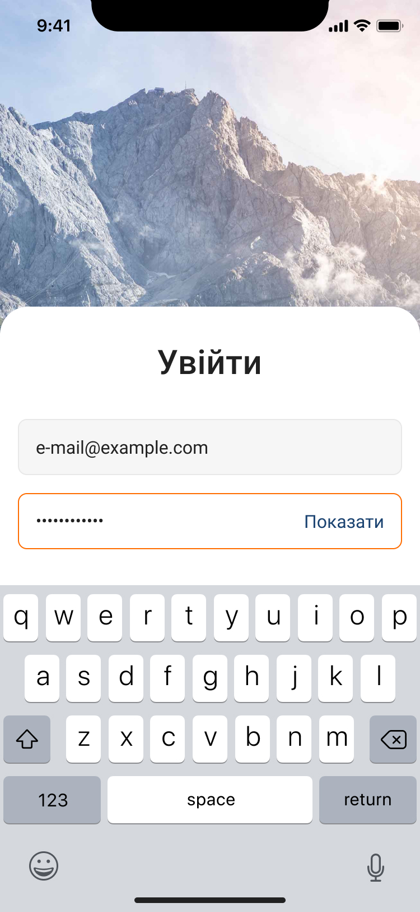
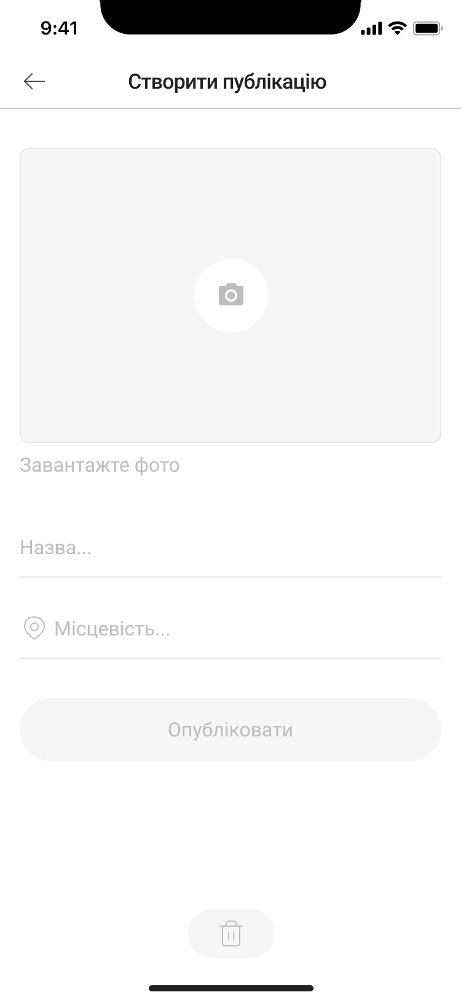
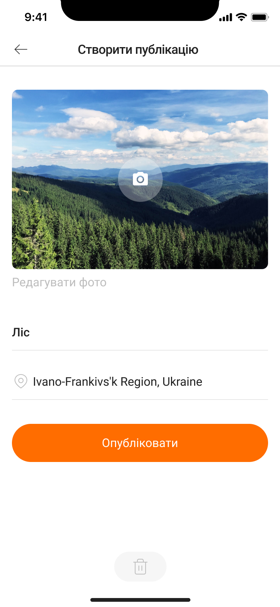
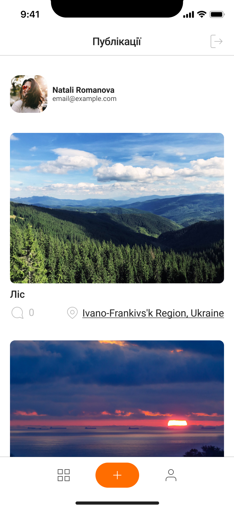
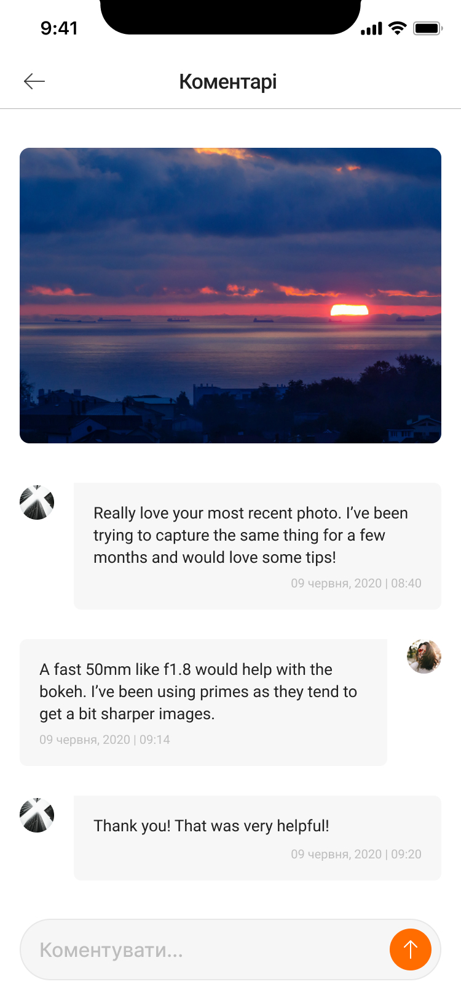
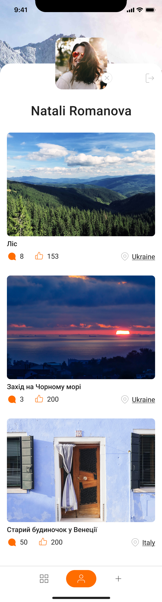

<h1 id="title">Mobile app "SnapMap Capture"</h1>

## Introducing

"SnapMap Capture" - a cutting-edge mobile application designed for both Android
and iOS devices. With secure user authentication, SnapMap Capture provides a
seamless and private experience for capturing and sharing your precious moments.

## Key Features:

1. Photo Capture: SnapMap Capture allows you to effortlessly take stunning
   photos using your smartphone's camera, ensuring every memorable scene is
   beautifully preserved.

2. Geotagging: Never lose track of your photographic adventures again! The app
   automatically records the precise location where each photo was taken,
   seamlessly integrating them into an interactive map.

3. Comments and Likes: Share your experiences and connect with other users by
   leaving comments on photos. Express your appreciation by giving likes to
   images that catch your eye.

4. Explore the Map: Dive into the captivating world of photography by exploring
   the interactive map, where you can browse photos taken by users from all
   around the globe. Uncover hidden gems and get inspired by the vast collection
   of picturesque locations.

5. User Profiles: Build your unique photography portfolio by creating a
   personalized profile. Showcase your talents, follow other users, and gain a
   following of your own.

6. Privacy and Security: Your data and photos are kept safe and secure. Enjoy
   peace of mind with SnapMap Capture's robust privacy measures, ensuring your
   content is only shared with those you choose.

## Frontend:

## Backend:

---

#### Registration

  
  

#### Login

  
  

#### Create post

  
  

#### Posts & Comments

  
  

#### Profile

  

## <a href="#title">Thank you for watching!</a>
